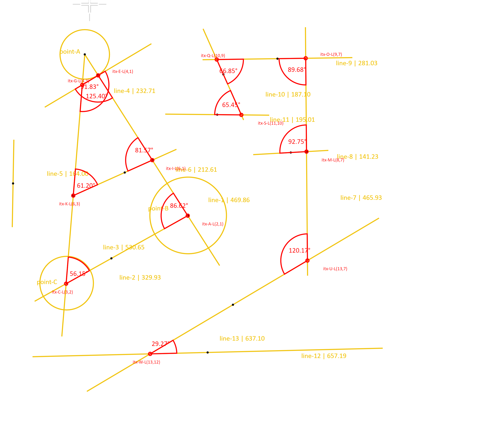
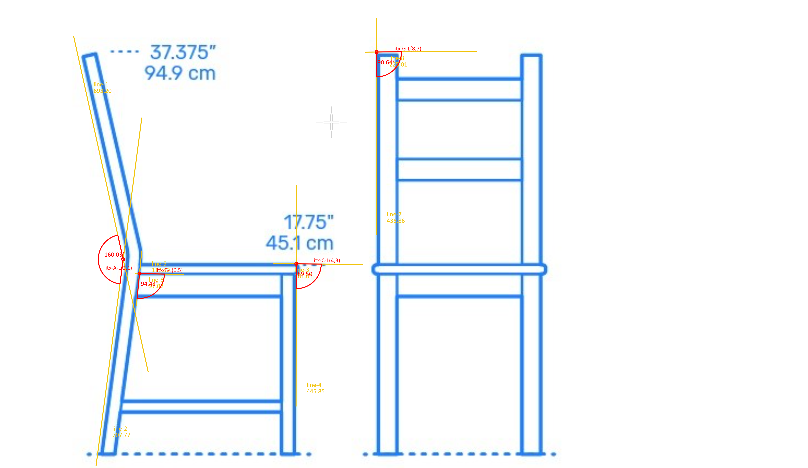
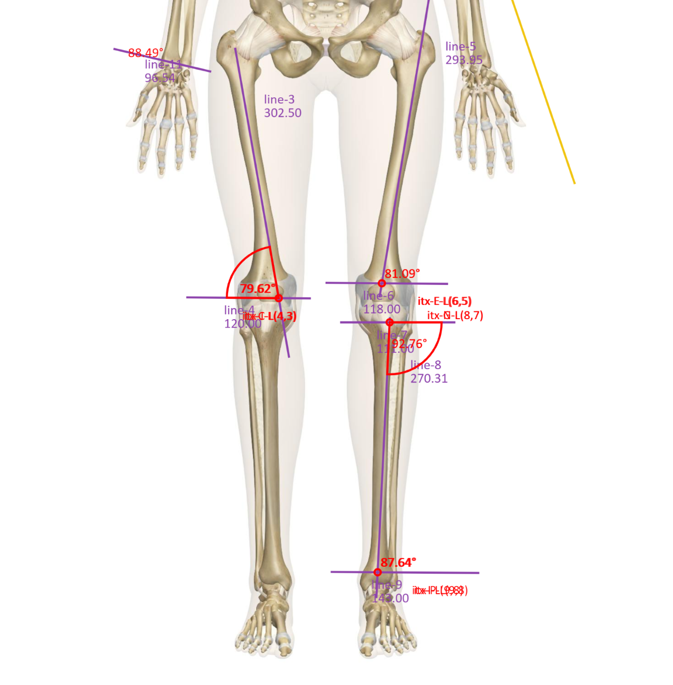

# Angle Estimator

Lightweight tool  to estimate angle from lines intersection

## Features

* Real time Line intersection computation
* Angle Estimator
* Angle's Arc Rendering
* Color Selection
* Scale Image
* Zoom View
* Export Image

## Usage

Basic usage:

```html
Open The File
Draw Circle
Draw Point
Drag line
Save File

```

## Options

Result:




```

## MIT License

(c) 2024 Dody Dharma
https://github.com/dodydharma
